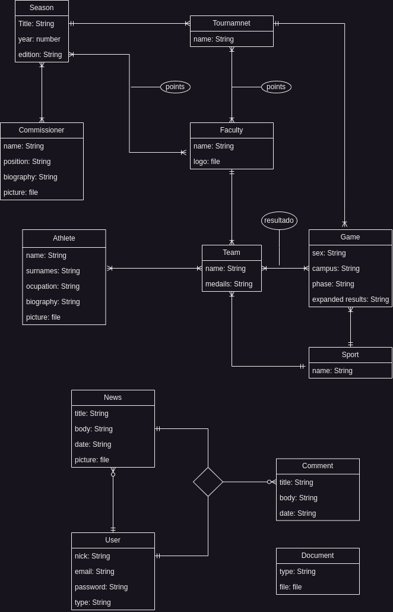

# Juegos Caribe

## Integrantes

* Christopher Guerra Herrero
* Amanda Cordero Lezcano
* Frank H Pérez Fleita
* Marian S Álvarez Suri
* Carlos A Breso Soto

La FEU de la UH nos ha encargado la importante tarea de crear un sistema para almacenar y mostrar la información de los juegos Caribe. Para lograr esto, es necesario guardar todos los datos relacionados con cada una de las Temporadas.

## Estructura de Datos

- Cada Temporada engloba competiciones entre las facultades en varios deportes.
- Las facultades se caracterizan por su nombre, logo, equipos participantes y resultados de temporadas anteriores.
- Los equipos están asociados con el deporte en el que compiten y los atletas que los conforman.
- Los atletas tienen nombre, apellidos, modalidad (curso por encuentro, curso diurno, trabajador, egresado, etc.) y, si son estudiantes, el año en el que cursan.
- Los deportes se identifican por su nombre.

## Usuarios y Roles

La aplicación debe ser accesible para diferentes tipos de usuarios:

- Cada usuario tiene un nombre y un rol (gestor, espectador).
- Los gestores pueden publicar noticias.
- Las noticias incluyen fecha, título, foto y cuerpo.
- Los espectadores pueden comentar en las noticias.
- Los espectadores también cuentan con correo y contraseña.
- Los comentarios tienen fecha y cuerpo.

## Cronograma de Partidos

- Un cronograma está compuesto por un conjunto de partidos.
- Cada partido involucra a dos o más equipos, tiene fecha y hora de inicio, sesión del día, sexo de los atletas involucrados, sede y etapa de competencia. También incluye el resultado y detalles del partido.

## Personal de la Comisión Organizativa

El sitio debe mostrar datos del personal que garantiza el correcto funcionamiento del evento. A estos miembros de la comisión organizativa les llamaremos comisionados.

- Cada comisionado tiene nombre, imagen, cargo y biografía.

## Documentos del Evento

Además, se deben almacenar ciertos documentos del evento.

- Cada documento tiene un tipo (reglamento, condiciones y términos de uso, política de privacidad, etc.) y un archivo.

## Preguntas a Resolver

La base de datos y la aplicación diseñada deben ser capaces de representar completamente el fenómeno descrito anteriormente, además de dar respuesta a preguntas como:

- Obtener los partidos de un día específico.
- Obtener la puntuación de las facultades en temporadas pasadas.
- Obtener los partidos entre dos fechas determinadas de un deporte específico.
- Obtener el total de medallas de una facultad en una temporada específica.
- Editar los resultados finales de un partido.
- Reajustar la fecha y hora de un partido.
- Agregar nuevos deportes.
- Eliminar atletas de un equipo.

## Requerimientos funcionales
La aplicación web de deportes debe realizar las siguientes funciones según los deseos
expresados por el cliente:

* Permitir al usuario buscar información sobre los Juegos Caribe de forma
  rápida y sencilla, introduciendo una frase o una palabra clave en un campo
  de búsqueda tipo Google.

*  Ofrecer al usuario la opción de realizar consultas  avanzadas, rellenando car-
  acterı́sticas que filtran los resultados, como el deporte, la facultad, el equipo
  o el atleta.

*  Visualizar el desempeño de una facultad, un equipo o un atleta en especı́fico,
  mostrando sus estadı́sticas.

*  Acceder a las noticias deportivas y el cronograma y puntuación de los juegos
  de distintos deportes, actualizados en tiempo real y con opción de recibir
  notificaciones o alertas.

*  El diseño web debe adaptarse perfectamente a cualquier dispositivo que esté
  utilizando el usuario, garantizando que sea responsivo. Una de las webs a las
  que podrı́a parecerse es el sitio oficial de los Juegos Olı́mpicos.
  (https://www.olympics.com)

## Requerimientos no-funcionales

* Requerimientos de seguridad: El sistema debe garantizar la protección de
  los datos personales y académicos de los participantes y organizadores de los
  juegos. Para ello, el acceso al sistema será controlado con nombres de usuario
  y contraseñas, que se asignarán a cada rol (expectador, comentarista, admin-
  istrador). Se incluirá un módulo para las tareas administrativas, reservado a
  los administradores, que permitirá gestionar los usuarios, las competencias,
  los resultados, etc.
* Requerimientos de almacenamiento, importación y exportación de datos: El
  sistema debe almacenar todos los datos en una base de datos MySQL, que
  es un sistema de gestión de bases de datos relacional, de código abierto y
  ampliamente utilizado.
* Requerimientos de usabilidad: El sistema debe ofrecer una interfaz de usuario
  sencilla, intuitiva y atractiva, que se adapte a los diferentes dispositivos y
  navegadores. La interfaz debe seguir las pautas de diseño web y los principios
  de accesibilidad, para asegurar una buena experiencia de usuario. El sistema
  debe permitir la interacción mediante el teclado, el mouse o la pantalla táctil,
  según las preferencias y las capacidades de cada usuario.
*  Requerimientos de mantenimiento y evolución: El sistema debe ser fácil de
  mantener y de modificar, para poder adaptarse a los cambios que puedan
  surgir en el futuro.
## Requerimientos de Entorno
  La aplicación web podrá ser ejecutada en cualquier dispositivo capaz de garantizar
  una conexión a Internet.
  Actualmente el cliente tiene la facilidad de crear una máquina virtual con suficiente
  almacenamiento y potencia para montar la aplicación.
  El entorno será desarrollado utilizando REACT para crear el frontend, y DJango
  para el backend. Además, la base de datos será manejada con MySQL

-------------------

## MERX

## Subesquemas

--------------------------------

### SE Documento
Atributos: 

* <u>idDocumento</u>
* Tipo
* Archivo

Dependencias funcionales:

* idDocumento => Tipo, Archivo

----------------------------------------------------

### SE Comisionado

Atributos: 

* <u>idComisionado</u>
* nombre
* cargo
* biografía
* foto

Dependencias funcionales:

* idComisionado => nombre, cargo, biografía, foto

--------------------

### SE Noticia

Atributos: 

* <u>idNoticia</u>
* título
* fecha
* cuerpo
* foto
* fk: idUsuario

Dependencias funcionales:

* idNoticia => título, fecha, cuerpo, foto

-------------------------

### SE Comentarios

Atributos: 

* <u>idComentario</u>
* título
* fecha
* cuerpo
* fk: idNoticia
* fk: idUsuario

Dependencias funcionales:

* idComentario => título, fecha, cuerpo, idNoticia, idUsuario

----------------------

### SE Usuario

Atributos: 

* <u>idUsuario</u>
* alias
* email
* contrseña
* tipo

Dependencias funcionales:

* idUsuario => alias, email, contrseña

---------------------------

### SE Comisionado - Temporada

Atributos: 

* <u>fk: idComisionado</u>
* <u>fk: idTemporada</u>

Dependencias funcionales:

* idComisionado, idTemporada => idComisionado, idTemporada

----------------

### SE Temporada

Atributos: 

* <u>idTemporada</u>
* título
* año
* edición

Dependencias funcionales:

* idTemporada => título, año, edición

----------------

### SE Facultad

Atributos: 

* <u>idFacultad</u>
* nombre
* logo

Dependencias funcionales:

* idFacultad => nombre, logo

--------------------------

### SE Torneo

Atributos: 

* <u>idTorneo</u>
* nombre
* fk: idTemporada

Dependencias funcionales:

* idTorneo => nombre, idTemporada

--------------------------

### SE Partido

Atributos: 

* <u>idPartido</u>
* fase
* sexo
* lugar
* resultados detallados
* fk: idTorneo
* fk: idDeporte

Dependencias funcionales:

* idPartido => fase, sexo, lugar, resultados detallados, idTorneo, idDeporte

--------------------

### SE Equipo

Atributos: 

* <u>idEquipo</u>
* medalla
* fk: idFacultad
* fk: idDeporte

Dependencias funcionales:

* idEquipo => medalla, idFacultad, idDeporte

---------------------------

### SE Atleta

Atributos: 

* <u>idAtleta</u>
* nombre
* ocupación
* foto
* biografía

Dependencias funcionales:

* idAtleta => nombre, ocupación, foto, biografía

-----------------------

### SE Deporte

Atributos: 

* <u>idDeporte</u>
* nombre

Dependencias funcionales:

* idDeporte => nombre

------------------------

### SE Temporada - Facultad

Atributos: 

* fk: <u>idTemporada</u>
* fk: <u>idFacultad</u>
* puntos

Dependencias funcionales:

* idTemporada, idFacultad => puntos

-----------------

### SE Torneo - Facultad

Atributos: 

* fk: <u>idTorneo</u>
* fk: <u>idFacultad</u>
* puntos

Dependencias funcionales:

* idTorneo, idFacultad => puntos

------------------------

### SE Equipo - Partido

Atributos: 

* fk: <u>idEquipo</u>
* fk: <u>idPartido</u>
* resultado

Dependencias funcionales:

* idEquipo, idPartido => resultado

------------------

### SE Equipo - Atleta

Atributos: 

* fk: <u>idEquipo</u>
* fk: <u>idAtleta</u>

Dependencias funcionales:

* idEquipo, idAtleta => idEquipo, idAtleta

--------------

El diseño anterior cumple 3FN pues todos los atributos de la parte izquierda de cada dependencia funcional son llaves de dicha relación. El diseño no cumple la PLJ, esta se podría forzar con el lema de Ullman, sin embargo no es de interés para el cliente. Dado este punto es un hecho que el diseño no es teóricamente correcto, sin embargo es un diseño eficiente para el problema en cuestión.