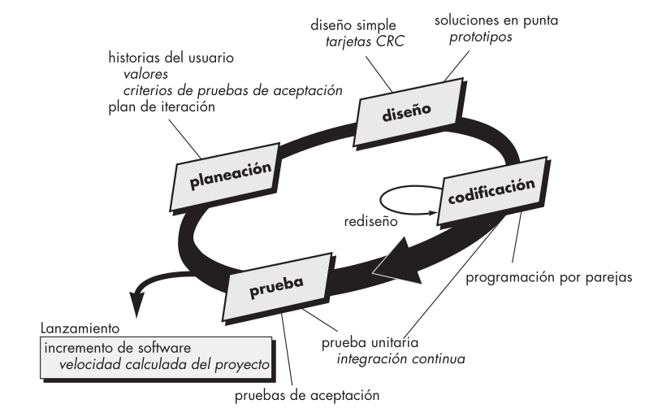

# Seminario de Metodologías

## <u>Autores</u>

* Marian S Álvarez Suri
* Carlos A Breso Soto
* Amanda Cordero Lezcano
* Christopher Guerra Herrero
* Frank H Pérez Fleita

## Estado del Arte

La programación extrema (XP) es un enfoque ampliamente utilizado en el desarrollo de software ágil. Kent Beck es el autor fundamental de la metodología, que se originó a finales de la década de 1980.

XP se basa en cinco valores fundamentales propuestos por Beck: comunicación, simplicidad, retroalimentación, valentía y respeto. Estos valores sirven como motores para las actividades específicas de XP.

* En cuanto a la __comunicación__, XP destaca la colaboración estrecha e informal entre clientes y desarrolladores, el uso de metáforas y la evitación de documentación extensa.
*  La __simplicidad__ se logra al diseñar solo para las necesidades inmediatas, creando un diseño simple que se puede mejorar en el futuro si es necesario.

* La __retroalimentación__ proviene de diversas fuentes, como el software implementado, el cliente y otros miembros del equipo. Las pruebas unitarias son esenciales en este proceso, proporcionando retroalimentación continua durante el desarrollo.
*  La __valentía__, o disciplina, se requiere para resistir la presión de diseñar para el futuro y en cambio, enfocarse en el diseño actual.

* Al adherirse a estos valores, XP fomenta el __respeto__ entre los miembros del equipo y hacia el proceso mismo.

El proceso XP se basa en un enfoque orientado a objetos y comprende cuatro actividades estructurales: planeación, diseño, codificación y pruebas.

* En la __planeación__, se escuchan los requerimientos, se crean historias del usuario y se asignan valores y costos. La colaboración entre clientes y desarrolladores decide la agrupación de historias para la siguiente entrega. La velocidad del proyecto se calcula durante la primera entrega para estimar futuras fechas de entrega.

* En el __diseño__, se sigue el principio de "mantenlo sencillo" (MS), se utilizan tarjetas CRC y se fomenta el rediseño para mejorar la estructura interna sin cambiar la funcionalidad externa.

* La __codificación__ implica el desarrollo de pruebas unitarias antes de la implementación y la programación por parejas, donde dos personas trabajan juntas en una estación de trabajo. La integración continua y las pruebas de regresión son cruciales en esta fase.

* Finalmente, las __pruebas__ incluyen pruebas unitarias, pruebas de integración y pruebas de aceptación derivadas de las historias de usuario. Este enfoque proporciona una retroalimentación constante, asegurando la calidad del software a lo largo del desarrollo.

## Aplicando XP a la web Juegos Caribe

La metodología XP funciona para nuestro proyecto pues contamos con:

* Feedback frecuente del cliente
* Tamaño y complejidad moderados
* Clientes y usuarios disponibles
* Colaboración y comunicación efectiva
* Equipo comprometido y autónomo

### Historias

1. Como usuario, quiero poder buscar rápidamente información sobre los Juegos Caribe utilizando un campo de búsqueda tipo Google, ingresando frases o palabras clave.

2. Como usuario, deseo realizar consultas detalladas filtrando los resultados por características específicas como deporte, facultad, equipo o atleta, para obtener información más específica y relevante.

3. Como interesado en el rendimiento deportivo, quiero poder visualizar estadísticas de una facultad, un equipo o un atleta en particular para evaluar su desempeño en los Juegos Caribe.

4. Como seguidor de los Juegos Caribe, quiero acceder a noticias deportivas, el cronograma y la puntuación de los juegos de distintos deportes, actualizados en tiempo real.

5. Como usuario de dispositivos móviles, espero que el diseño web de la aplicación se adapte perfectamente a mi dispositivo, garantizando una experiencia responsiva. Me gustaría que la interfaz siguiera las pautas de diseño web y principios de accesibilidad, permitiendo una interacción fácil mediante teclado, mouse o pantalla táctil.

6. Como administrador del sistema, necesito un módulo para gestionar usuarios, competencias, resultados, etc. Además, el sistema debe garantizar la protección de datos personales y académicos mediante acceso controlado con nombres de usuario y contraseñas asignados a cada rol.

### Tareas

1. **Búsqueda Rápida de Información:**
   - Implementar un campo de búsqueda en la interfaz de usuario.
   - Integrar la funcionalidad de búsqueda con la base de datos.
   - Garantizar la velocidad y eficacia de la búsqueda.
2. **Consultas Avanzadas:**
   - Crear una interfaz para ingresar y filtrar características avanzadas.
   - Implementar lógica de filtrado de resultados basada en características seleccionadas.
3. **Visualización de Estadísticas:**
   - Desarrollar un sistema para recopilar y mostrar estadísticas.
   - Integrar visualizaciones para mejorar la comprensión de las estadísticas.
4. **Acceso a Noticias y Cronograma:**
   - Integrar una fuente de noticias deportivas y un sistema de cronograma.
5. **Diseño Responsivo:**
   - Implementar un diseño responsivo que se adapte a diferentes dispositivos y navegadores.
   - Verificar la compatibilidad con varios tamaños de pantalla.
6. **Módulo de Administración y Seguridad:**
   - Crear un módulo de administración para la gestión de usuarios, competencias y resultados.
   - Implementar el sistema de control de acceso con nombres de usuario y contraseñas.

### Programación en pareja

XP recomienda que dos personas trabajen juntas en una estación de trabajo con el objeto de crear código para una historia. En la práctica, cada persona adopta un papel un poco diferente. Por ejemplo, una de ellas tal vez piense en los detalles del código de una porción particular del diseño, mientras la otra se asegura de que se siguen los estándares de codificación (parte necesaria de XP) o de que el código para la historia satisfará la prueba unitaria desarrollada a fin de validar el código confrontándolo con la historia. En Juegos Caribe, aplicamos esta metodología en la actualidad pues, dos personas trabajan juntas en el desarrollo del Frontend, compartiendo ideas y líneas de trabajo; mientras que las otras tres trabajan en el backend. En ambas partes hay un encargado de que siguen los estándares de codificación.

### Pruebas

**Pruebas Unitarias:**

Las pruebas unitarias se centran en verificar el correcto funcionamiento de unidades individuales de código. Una unidad puede ser una función, un método o un procedimiento. El objetivo principal de las pruebas unitarias es garantizar que cada unidad de código funcione como se espera y produzca los resultados correctos. Estas pruebas son escritas y ejecutadas por los propios desarrolladores.
Django utiliza la biblioteca estándar de Python llamada `unittest` para pruebas unitarias. Permite la creación de casos de prueba y proporciona aserciones para verificar resultados. Se pueden realizar pruebas de modelos, vistas, formularios, entre otros componentes.

**Pruebas de Integración:**

Las pruebas de integración se llevan a cabo para validar la interacción y la cooperación entre diferentes unidades de código o módulos. El objetivo es asegurarse de que las partes del sistema, que han sido probadas individualmente mediante pruebas unitarias, funcionen correctamente cuando se integran para formar un sistema más grande.
La clase `LiveServerTestCase` de Django permite realizar pruebas de integración que involucran un servidor web en tiempo real. Útil para pruebas que requieren interacción con el servidor, como pruebas de extremo a extremo. El módulo `django.test.Client` ofrece una interfaz para simular solicitudes HTTP durante las pruebas de integración. Facilita la interacción y la verificación de respuestas HTTP.

### Algunas tarjetas CRC de ejemplo

<table>
  <tr>
    <th>Facultad</th>
  </tr>
  <tr>
    <td><strong>Responsabilidades</strong></td>
    <td><strong>Colaboradores</strong></td>
  </tr>
  <tr>
    <td>- Conocer nombre</td>
    <td>Equipos</td>
  </tr>
  <tr>
    <td>- Conocer equipos participantes</td>
    <td></td>
  </tr>
  <tr>
    <td>- Conocer logo</td>
    <td></td>
  </tr>
</table>

<table>
  <tr>
    <th>Equipo</th>
  </tr>
  <tr>
    <td><strong>Responsabilidades</strong></td>
    <td><strong>Colaboradores</strong></td>
  </tr>
  <tr>
    <td>- Conocer deporte al que pertenece</td>
    <td>Deporte</td>
  </tr>
  <tr>
    <td>- Conocer atletas que contiene</td>
    <td>Atletas</td>
  </tr>
  <tr>
    <td>- Conocer facultad a la que peretenece</td>
    <td>Facultad</td>
  </tr>
</table>

<table>
  <tr>
    <th>Atleta</th>
  </tr>
  <tr>
    <td><strong>Responsabilidades</strong></td>
    <td><strong>Colaboradores</strong></td>
  </tr>
  <tr>
    <td>- Conocer nombre y apellidos</td>
    <td></td>
  </tr>
  <tr>
    <td>- Conocer biografía</td>
      <td></td>
  </tr>
  <tr>
    <td>- Conocer foto</td>
    <td></td>
  </tr>
</table>

<table>
  <tr>
    <th>Deporte</th>
  </tr>
  <tr>
    <td><strong>Responsabilidades</strong></td>
    <td><strong>Colaboradores</strong></td>
  </tr>
  <tr>
    <td>- Conocer nombre</td>
    <td></td>
  </tr>
</table>

### Ventajas:

1. **Flexibilidad y Adaptabilidad:** XP permite adaptarse rápidamente a cambios en los requisitos del cliente, lo que es esencial en entornos donde los requerimientos evolucionan.
2. **Retroalimentación Continua:** La retroalimentación constante a través de pruebas y la participación del cliente aseguran que el producto se ajuste a las expectativas.
3. **Mejora Continua:** La filosofía de mejora continua, incluido el rediseño constante, contribuye a la evolución positiva del software.

### Desventajas:

1. **Falta de Documentación Detallada:** La falta de documentación exhaustiva puede dificultar la comprensión del sistema, especialmente para nuevos miembros del equipo.

2. **Requiere Disciplina:** La autorganización y la toma de decisiones requieren disciplina y puede ser difícil mantenerse enfocado sin una estructura de gestión más tradicional.

3. **No Apto para Todos los Proyectos:** Puede no ser adecuado para proyectos grandes o complejos que requieran una planificación más detallada y estructurada.

### Rol del Jefe de Equipo:

La autorganización puede funcionar bien en equipos maduros y altamente colaborativos, donde todos los miembros tienen habilidades técnicas y de comunicación sólidas. Sin embargo, en equipos menos experimentados o con personalidades conflictivas, un líder puede ser esencial para mantener la cohesión y la dirección. Las decisiones del equipo autorganizado pueden ser beneficiosas cuando se trata de creatividad, motivación y compromiso. Sin embargo, para decisiones críticas, especialmente en términos de alcance y prioridades, la participación del liderazgo puede ser crucial para garantizar la alineación con los objetivos del negocio.

### Equipos Autorganizados y Mejores Arquitecturas:
La autorganización fomenta la participación activa y la responsabilidad individual en la toma de decisiones arquitectónicas y de diseño. Cuando los equipos están altamente comprometidos, pueden surgir soluciones innovadoras y efectivas. Sin embargo, esta ventaja depende en gran medida de la experiencia y la madurez del equipo. Equipos menos experimentados pueden beneficiarse de la orientación y la supervisión adicional para asegurar la calidad arquitectónica.
